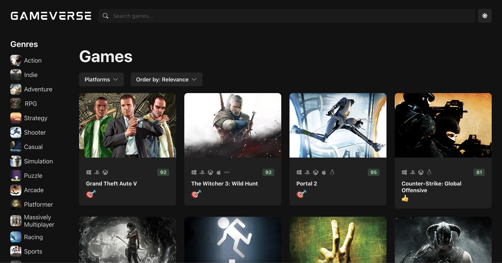

# 🎮 React-Typescript-Game-Verse 🚀

A sleek, modern, and interactive **game discovery web app** built with **React**, **TypeScript**, and **React Query**.  
Explore, search, and filter your favorite games with a **stunning UI**, powered by the **RAWG.io API** for real-time game data.

🌟 **Discover. Search. Play.**

🔗 **Live Demo:** [Game Verse](https://gameverse.shahzadtariq.com/) 🌍



---

## ✨ Features ✨

✅ **Browse & Search** – Find games by **genre, platform, and rating**. 🎮  
✅ **Smart Filtering & Sorting** – Narrow down results with multiple criteria. 🎯  
✅ **Responsive & Modern UI** – Built with **Chakra UI** for a smooth experience. 📱💻  
✅ **Infinite Scrolling** – Seamless game browsing without pagination. 🔄  
✅ **Optimized Performance** – **React Query** for efficient API fetching & caching. ⚡  
✅ **Smooth Animations** – Powered by **Framer Motion**. 🏃‍♂️💨  
✅ **State Management** – Lightweight & fast **Zustand** store. 🏗️  
✅ **Game Data from RAWG.io API** – Stay up-to-date with a vast gaming database. 🎲

---

## 🛠️ Tech Stack

🔹 **React** – UI library for building interactive applications. ⚛️  
🔹 **TypeScript** – Type safety for robust development. 📌  
🔹 **React Query** – Smart caching & efficient data fetching. 📡  
🔹 **Chakra UI** – Beautiful and accessible component library. 🎨  
🔹 **Zustand** – Fast and minimal state management. 🏎️  
🔹 **Axios** – Easy HTTP requests. 🌍  
🔹 **Framer Motion** – Elegant animations and transitions. 🎬  
🔹 **React Icons** – A diverse collection of icons. 🖼️  
🔹 **React Router** – Seamless navigation experience. 🛤️  
🔹 **Infinite Scroll Component** – Enables smooth infinite scrolling. 🔄  
🔹 **RAWG.io API** – Real-time game information provider. 🎮

---

## 📦 Dependencies 📦

This project is powered by the following libraries:

```json
{
  "dependencies": {
    "@chakra-ui/react": "^2.10.5",
    "@emotion/react": "^11.14.0",
    "@emotion/styled": "^11.14.0",
    "@tanstack/react-query": "4.28",
    "@tanstack/react-query-devtools": "4.28",
    "axios": "^1.7.9",
    "framer-motion": "^12.0.6",
    "react": "^18.2.0",
    "react-dom": "^18.2.0",
    "react-icons": "^5.4.0",
    "react-infinite-scroll-component": "6.1",
    "react-router-dom": "^6.10.0",
    "zustand": "^4.3.7"
  }
}
```

---

## 🚀 Getting Started

### 1️⃣ Clone the Repository 🛠️

```sh
git clone https://github.com/Shaz-gill/react-typescript-game-verse.git
```

### 2️⃣ Navigate to the Project Directory 📂

```sh
cd react-typescript-game-verse
```

### 3️⃣ Install Dependencies 📦

```sh
npm install
```

### 4️⃣ Start the Development Server 🚀

```sh
npm run dev
```

🔹 Open **http://localhost:5173/** (or the displayed URL) in your browser.

---

## ⚠️ API Key Warning 🔒

⚠️ **Important:**  
This project **directly exposes the RAWG API key in the frontend**. Be mindful of API usage limits and potential security risks.  
For **better security**, consider using a backend proxy to handle API requests and hide your API key in an environment variable.

---

## 📜 License 📝

This project is licensed under the **MIT License**.  
Feel free to **use, modify, and distribute** it as you like! 🎉

---
